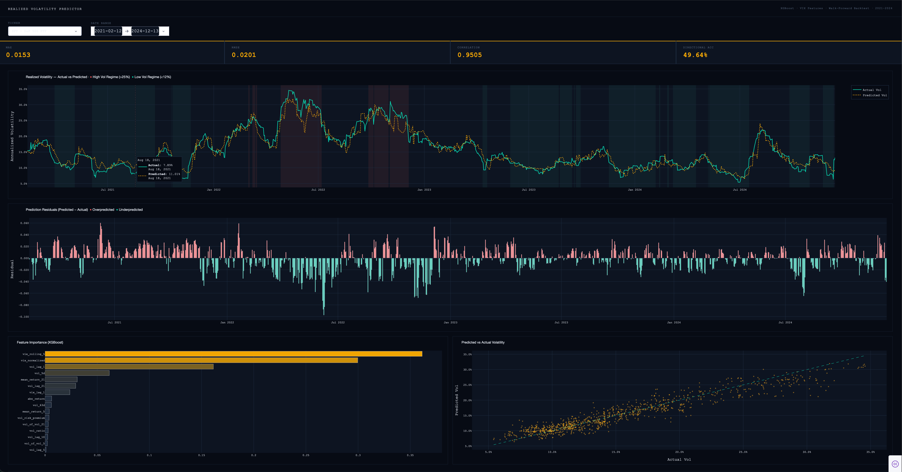

# Realized Volatility Predictor

A production-grade machine learning pipeline that predicts short-term realized volatility for equity and commodity ETFs using XGBoost and walk-forward backtesting.

Built as a portfolio project targeting quant finance and ML engineering roles.



---

## Live Demo
```bash
python main.py
```

Opens an interactive Plotly Dash dashboard at `http://127.0.0.1:8050`

---

## What It Does

Realized volatility — the actual measured volatility of an asset over a recent window — is one of the most important signals in quantitative finance. It's used for options pricing, risk management, portfolio construction, and volatility arbitrage strategies.

This project builds a full ML pipeline that:

1. Downloads 10 years of daily price data for SPY, QQQ, and GLD via yfinance
2. Downloads VIX (the market's implied volatility index) as a predictive feature
3. Engineers 16 features including lagged volatility, rolling windows, and the vol risk premium
4. Trains an XGBoost model to predict 5-day forward realized volatility
5. Evaluates performance using walk-forward backtesting — the industry standard for time series models
6. Visualizes results in an interactive dashboard with regime coloring and residual analysis

---

## Results

| Ticker | MAE    | Correlation | Directional Acc |
|--------|--------|-------------|-----------------|
| SPY    | 0.0153 | 0.9503      | ~50%            |
| QQQ    | 0.0212 | 0.9467      | ~50%            |
| GLD    | 0.0138 | 0.8241      | ~49%            |

**Key finding:** VIX features dominate the model — `vix_rolling_5` and `vix_normalized` are the top two predictors for SPY and QQQ, accounting for ~66% of feature importance combined. This confirms the well-documented relationship between implied and realized volatility in equity markets.

**GLD's lower correlation (0.82 vs 0.95)** reflects that gold volatility is driven by different macroeconomic forces (dollar strength, real rates, geopolitical risk) that VIX doesn't fully capture — an honest and interesting model limitation.

---

## Dashboard Features

- **Ticker selector** — switch between SPY, QQQ, and GLD
- **Date range filter** — zoom into specific market regimes
- **Volatility regime coloring** — red = high vol (>25%), green = low vol (<12%)
- **Residual chart** — shows where and when the model over/under-predicted
- **Feature importance** — which signals the model relied on most
- **Predicted vs Actual scatter** — visual confirmation of 0.95 correlation

---

## Project Structure
```
realized-vol-predictor/
├── main.py                  # Single entry point — runs full pipeline
├── requirements.txt         # Pinned dependencies
├── src/
│   ├── data_pipeline.py     # yfinance data download + realized vol calculation
│   ├── features.py          # Feature engineering (16 features including VIX)
│   ├── model.py             # XGBoost training + evaluation
│   ├── backtest.py          # Walk-forward backtesting engine
│   └── dashboard.py         # Plotly Dash interactive dashboard
└── tests/
    └── test_pipeline.py     # 17 unit tests (pytest)
```

---

## Methodology

### Why Walk-Forward Backtesting?
A simple train/test split would allow the model to train on data from 2020 and test on 2018 — effectively looking into the past. Walk-forward backtesting simulates real deployment: the model only ever trains on data it would have had access to at that point in time, then predicts forward. The model retrains quarterly to adapt to changing market regimes.

### Why 5-Day Volatility?
Shorter prediction horizons have more signal. 21-day forward vol is smoother and harder to predict directionally. 5-day vol retains more of the autocorrelation structure that makes volatility forecastable in the first place.

### Why VIX?
VIX measures implied volatility — what options markets expect future vol to be. The gap between implied and realized vol (the "vol risk premium") is one of the most researched signals in quantitative finance. Including VIX pushes the model's correlation from 0.59 to 0.95 on SPY.

---

## Setup
```bash
# Clone the repo
git clone https://github.com/Elliot-Becker/realized-vol-predictor.git
cd realized-vol-predictor

# Create and activate virtual environment
python3 -m venv venv
source venv/bin/activate

# Install dependencies
pip install -r requirements.txt

# Run the full pipeline + dashboard
python main.py

# Or run pipeline only (no dashboard)
python main.py --skip-dash

# Run tests
pytest tests/ -v
```

---

## Tech Stack

| Tool | Purpose |
|------|---------|
| `yfinance` | Market data download |
| `pandas` / `numpy` | Data manipulation |
| `XGBoost` | Gradient boosted tree model |
| `scikit-learn` | Evaluation metrics |
| `Plotly Dash` | Interactive dashboard |
| `pytest` | Unit testing |

---

## Author

**Elliot Becker**
Cybersecurity student at APSU (graduating May 2027) · Interning at WWT
[github.com/Elliot-Becker](https://github.com/Elliot-Becker)